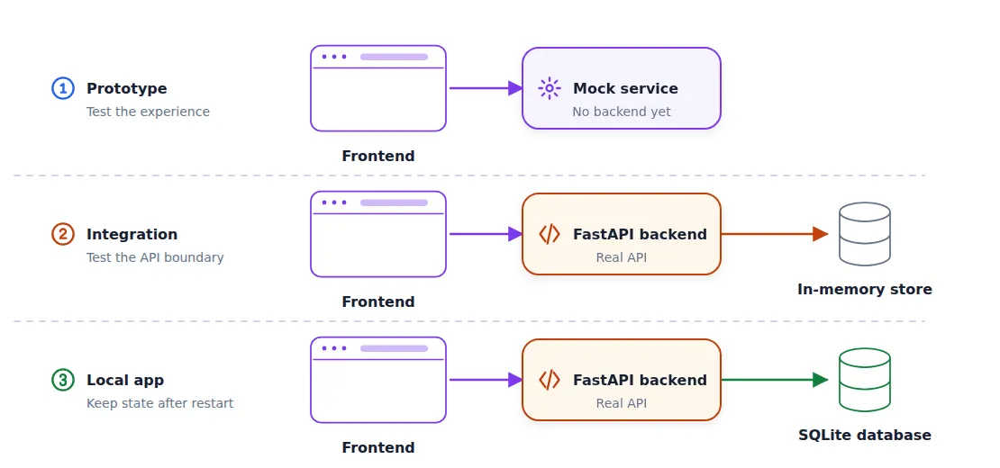
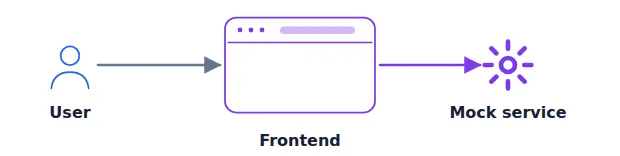

# Build and Ship a Full-Stack App with AI Coding Assistants

## Overview

From there, we start building:

1. Generate a frontend that uses mocked backend calls.

2. Establish backend-frontend contract by creating OpenAPI specifications from the frontend service layer.

3. Implement the FastAPI backend, connect it to the frontend, and test the application.

4. Add persistence with SQLite and SQLAlchemy.

At each stage we get something concrete that we can test:

- First we define the specification and make sure it reflects what we want to build.

- After that, we use the specs to create a frontend prototype that we can interact with. We mock backend calls so we can test the idea.

- Then we connect the frontend to the backend. We start with an in-memory store to make sure the frontend-backend connection works.

- Finally, we add a database so the application keeps its state after a restart.

At the end, we have a working local application that is ready for deployment.

<p align="center">
  
  <p align="center">The interfaces stay stable while temporary components are replaced one at a time</p>
</p>

# Start with a specification

Before building the frontend, we need to describe the application precisely. If we don’t do it, we will get something that works but we don’t need.

For our application, we need to specify:

- who creates an interview session

- how a candidate joins it

- which components they can place on the canvas

- how both people see changes in real time

This is called “Specification-Driven Development”. For creating the specification, I always use ChatGPT in dictation mode. Give the assistant as much information as possible at this stage.

The result is [here](app/_docs/spec.md)

## Frontend First

Now we have the specification, but it’s only text. There are multiple options of what you can do next:

- Focus on the database layer, define the entities, and work all the way up through backend to frontend
- Alternatively, you can start with specifying OpenAPI and define how backend and frontend interact and build both independently from there
- Or you can focus on the frontend first and then build the rest

All these approaches make sense and have their pros and cons.

For simple projects that you’re building alone, I recommend starting with frontend. You can quickly judge if you’re moving in the right direction, and if it solves your problem or not.

Treat it as a way to test your idea and your specification, and do it before you build the rest of the application.

For this step I like using Lovable, which generates a React app from one prompt. Claude Design, Replit, v0, and Bolt are similar tools that you can use instead.

Alternatively, you can start with coding assistants directly and ask them to create a React app (or whatever technology you want).

I use Lovable because it creates really nice designs. Also, I’m not a frontend engineer and I don’t know much about the frontend world. Lovable makes technology choices for me that I know will make sense, while a coding agent can select something randomly.

Now open any tool of your choice and give it this prompt:

```
Create a system design interview application.

[Paste the ChatGPT-generated specification here.]

Centralize every backend call in one services layer, and create a mock
implementation of it so the whole app runs without a real backend.

Add tests.
```

This part is quite important:

> Centralize every backend call in one services layer, and create a mock implementation of it so the whole app runs without a real backend.

Without it, the agent can do something arbitrary, but here we explicitly say that we want a mock service. Later, it will become the single point of integration of our frontend with backend. And because we mock it, it will work from the beginning.

<p align="center">
  
  <p align="center">The frontend is real and interactive; only its backend service is mocked</p>
</p>

Lovable creates a React app in TypeScript. We can interact with it in the Lovable interface.

Next, save it to GitHub. If you use Lovable:

- Select the plus icon in the bottom-left corner
- Connect your GitHub account.
- Lovable creates a private repository. I usually change it to public.

## Move the Frontend into the Project

Next, we can clone the repository locally.

For the rest of the project, I want this setup:

```
/backend     # backend application and its tests
/docs        # supporting documentation
/frontend    # frontend application
AGENTS.md    # instructions for coding agents
openapi.yaml # API agreement
```

So let’s create these folders and move all the frontend stuff to “frontend”, and the specification we created to “/docs/spec.md”.

After we re-arranged the files, commit the changes.

At this point, you should also be able to run the application locally and test that things work the way you want. If they don’t, use a coding agent to fix it.

To run the project:

```
cd frontend
npm i
npm run dev
```

## AGENTS.md

We already discussed the importance of AGENTS.md in the first article.

Let’s create one for this project too. Place it in the repository root:

```
for backend, use uv for dependency management. a few useful commands:

uv sync
uv add <PACKAGE-NAME>
uv run python <PYTHON-FILE>

regularly commit code to git
```

This is only the starting point and it will change as your project grows.

## OpenAPI Specifications

When creating frontend, we asked the AI assistant to put everything in a centralized service layer. Later we will replace it with actual calls to backend.

But now we should define the specification - the agreement between frontend and backend. We will use OpenAPI for that.

This specification gives explicit information about the endpoints, paths, request bodies, response bodies, and authentication rules.

<p align="center">
  
  <p align="center">OpenAPI is the explicit contract shared by the frontend and backend</p>
</p>

Let’s create it:

```
Read the frontend's API client in frontend/

Create openapi.yaml at the repository root.

Specify the backend this frontend expects: every endpoint, method, path, request body, response body, and which endpoints need authentication.
```

You can skip this step. But I wouldn’t recommend it.

It takes a few minutes, but has many benefits. The backend gets a precise target instead of being inferred from frontend code. Not only we save tokens this way, but also get a clear picture of what exactly the backend needs.

## The Backend

Now we have the OpenAPI specs and we can use this file to create the backend. We will use Python and FastAPI for that. But you can choose any technology you want.

When I start with frontend, I use a mocked backend and then replace it with a real one. In the same way, for FastAPI backends, I start with a mocked database, and then later change it.

I do that because I want to make sure the frontend-backend connection works, and until it’s smooth, I don’t worry about the persistence.

Let’s ask the coding assistant to implement it:

```
Build a FastAPI backend in backend/ that implements the openapi.yaml spec.

Use an in-memory store and seed it with data so the frontend has something to show. Add authentication with hashed passwords and bearer tokens for the endpoints that need it.

Split the code into modules - routers, models, store, auth

Write tests
```

After 5-10 minutes, you will have the backend ready.

## Makefile

When it’s ready, you can run the application. Normally, for FastAPI, the command is something like that:

```
cd backend
uv run uvicorn backend.main:app --reload --port 8091
```

I’ll use port 8091 but you can replace it with any other port you like.

But for me it’s always hard to remember these commands, so I ask the coding assistant to create a Makefile:

```
Create a Makefile so I can easily run it.
```

Then running it is as simple as

```
make run
```

These are all the commands in the Makefile (run them from the `app/` folder):

| Command | What it does |
|---|---|
| `make help` | List all commands |
| `make install` | Install frontend (npm) and backend (uv) dependencies |
| `make run` | Run the backend on http://localhost:8091 |
| `make dev` | Run the backend and the frontend (http://localhost:5173) together |
| `make backend` / `make frontend` | Run only one of them |
| `make test` | Run all tests (`make test-backend`, `make test-frontend` for one side) |
| `make lint` | Type-check the frontend, lint and format-check the backend |
| `make build` | Build the frontend for production |
| `make clean` | Remove build output and caches |

Ports can be overridden, e.g. `make run BACKEND_PORT=9000`.

When it’s running, open http://localhost:8091/docs in the browser. You will see the OpenAPI specification of the implemented backend.

We can compare it with the actual specs. From this point we no longer need the original openapi.yaml - the one that’s generated by FastAPI is enough.
