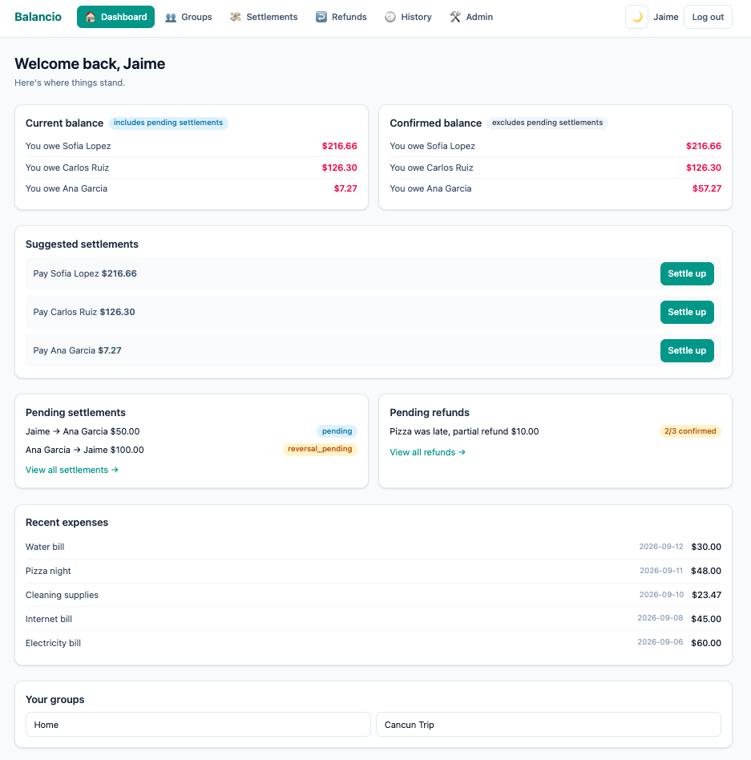
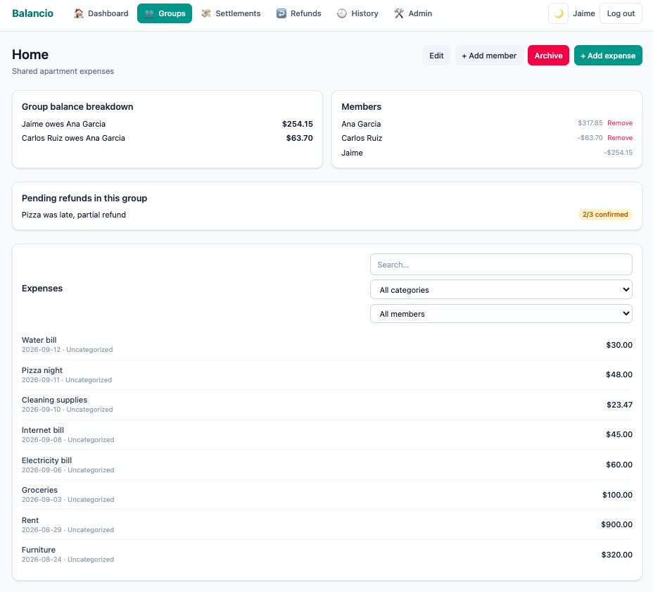
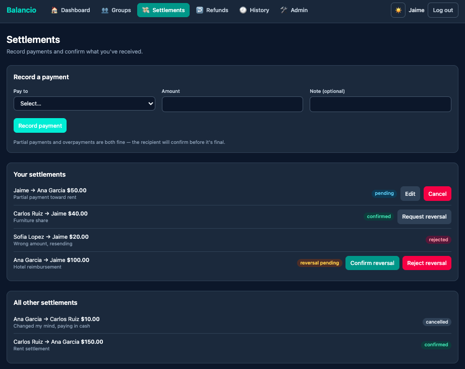
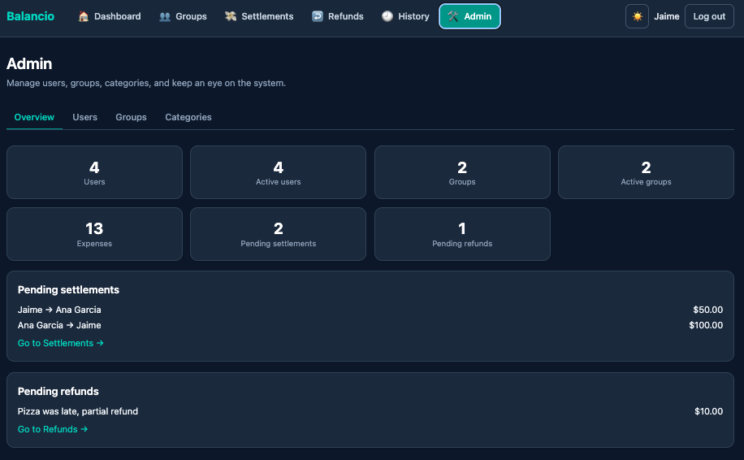

# Balancio

Split expenses. Settle balances.

Balancio is a general-purpose shared expense splitter for friends, households, couples, trips, and other small groups. It supports users and groups, expenses with multiple payers and equal splits, group and global balance tracking, simplified settlement suggestions, settlements, and refunds.

See [`_docs/specs.md`](_docs/specs.md) for the full product and implementation specification, and [`openapi.yaml`](openapi.yaml) for the REST API contract.

## Screenshots

| Dashboard                                                                                                                | Group detail                                                                                |
| ------------------------------------------------------------------------------------------------------------------------ | ------------------------------------------------------------------------------------------- |
|  |  |

| Settlements                                                                                                                 | Admin overview                                                                                     |
| --------------------------------------------------------------------------------------------------------------------------- | -------------------------------------------------------------------------------------------------- |
|  |  |

## Prerequisites

- Python 3.11+
- [`uv`](https://docs.astral.sh/uv/) for Python dependency and environment management
- Node.js 20+ and npm

## Backend setup

```bash
cd backend
uv sync
uv run fastapi dev app/main.py
```

The API is served under `/api/v1`. FastAPI's automatically generated OpenAPI/Swagger docs (available at `/docs` while the server is running) are sufficient for API exploration.

### Environment variables

Copy `backend/.env.example` to `backend/.env` and adjust as needed:

```env
APP_NAME=Balancio
APP_CURRENCY=MXN
JWT_SECRET=change-me
JWT_EXPIRATION_HOURS=8
DATABASE_URL=sqlite:///./data/balancio.db
ENVIRONMENT=development
```

Data persists to a local SQLite database (`backend/data/balancio.db`), accessed via SQLAlchemy through a repository abstraction, across restarts. No database server is required for the MVP; `DATABASE_URL` can later point at Postgres/MySQL/etc. without touching business logic.

## Frontend setup

```bash
cd frontend
npm install
npm run dev
```

The frontend talks to the backend over HTTP at the URL in `VITE_API_BASE_URL`
(see `frontend/.env.example`), defaulting to `http://localhost:8000/api/v1`
when unset — i.e. the backend's default `fastapi dev` address. Start the
backend first (or alongside) so the frontend has something to talk to; CORS
is preconfigured on the backend for the frontend's dev origin
(`http://localhost:5173`).

## Running tests

```bash
# Backend unit, API/integration tests
cd backend
uv run pytest

# Frontend component tests
cd frontend
npm test

# End-to-end tests
cd frontend
npm run test:e2e
```

No Docker or deployment configuration is required to run Balancio locally.
