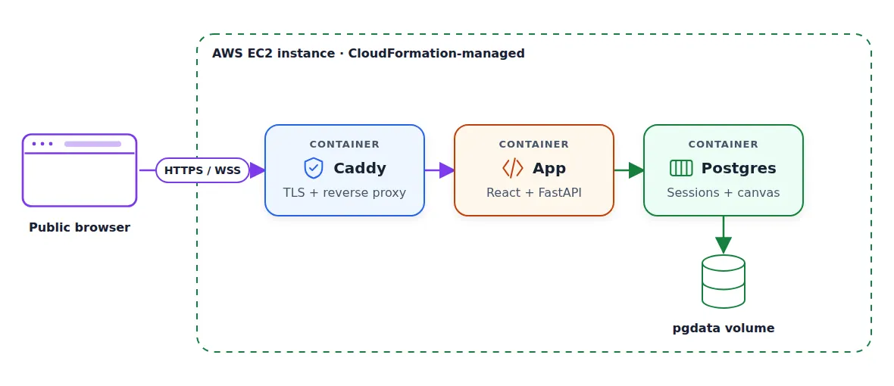

# Deploy a Full-Stack App with AI Coding Assistants

## Containerization

When we run the application locally, we need to execute two commands: one for the frontend and one for the backend.

Let’s run them in two separate terminals:

```
# first terminal
cd frontend
npm run dev

# second terminal
make run
```

So, we have two services, and we need to deploy them to production. We may think that we need two containers: one for the frontend and one for the backend.

During development, we run the frontend as a separate service because we use Vite. Vite watches the frontend code and refreshes the page when we make changes. It’s very convenient because we can see our changes immediately.

In production, the frontend code doesn’t change while the application is running. We build it once and get a set of static HTML, CSS, and JavaScript files.

This means we don’t need a separate container for the frontend: the backend can serve these files. So, we need only one container.

<p align="center">
  
  <p align="center">In development (1), the frontend and backend run separately. In production (2, 3), FastAPI serves the built frontend from one container</p>
</p>

Ask the coding assistant to create it:

```
Create a Dockerfile that builds the frontend with Node, then builds a Python image with the backend and the frontend static files.

Backend should serve the frontend.
```

We get a two-stage Docker build:

- First, we use a Node.js image to compile the frontend

- Then we build the backend and copy only the frontend files without the Node.js dependencies

Build and run the image from the repository root:

```
docker build -t sdip:latest .

docker run --rm -p 8091:8091 \
  -v sdip-data:/data \
  -e SDIP_DATABASE_URL=sqlite:////data/sdip.db \
  --name sdip sdip:latest
```

Here we specify a named Docker volume sdip-data that will keep the SQLite database between container runs.

Open the application at localhost:8000 and test it:

- Create an interview session

- Open the join link in a different browser window

- Move an element in the candidate window

- Check that the interviewer sees the change

We’ll repeat this test again. I’ll refer to it as the two-session test.

## Switch from SQLite to Postgres

SQLite is very convenient for local development. It keeps the data in a single file and doesn’t need a separate database server.

But for production, we typically use Postgres or a similar database.

When we set up the foundation in the previous article, we asked the coding agent to use SQLAlchemy.

I did this on purpose because I knew that later I’d switch to Postgres.

Start Postgres locally:

```
docker run -d \
  --name interview-canvas-db \
  -e POSTGRES_USER=sdip \
  -e POSTGRES_PASSWORD=sdip \
  -e POSTGRES_DB=sdip \
  -p 5432:5432 \
  -v interview-canvas-pgdata:/var/lib/postgresql/data \
  postgres:16-alpine
```

Now we can ask the assistant to use it:

```
Add Postgres support to the backend.
```

When it’s done, repeat the two-session test.

## Docker Compose

Previously, I started a Postgres container with a separate command. But now let’s put all the services our application needs inside one Docker Compose file.

With this file, we can run our entire application with a single command docker compose up.

Ask the assistant to implement it:

```
Create docker-compose.yaml with two services: Postgres and the app.
```

The file defines the database and adds a health check, so our application waits until Postgres is ready to accept connections.

Start it:

```
docker compose up --build
```

In our case, it runs the application at localhost:8100.

<p align="center">
  
  <p align="center">We run the application with Postgres using Docker Compose</p>
</p>

## Integration and end-to-end tests

The AI assistant might have created some backend tests.

If it didn’t, ask it to create integration tests:

```
Create integration tests that run against docker-compose.yaml. What scenarios should we test?
```

We added two things that can potentially break, so let’s test them too. We’ll verify that:

- The frontend compiles correctly

- The backend can communicate with Postgres

<p align="center">
  
  <p align="center">Playwright can run the two-session test for us</p>
</p>

Ask the AI assistant to implement a test:

```
Add an end-to-end test that runs against docker-compose.yaml.

Use Playwright to:

1. Log in as the interviewer (session 1).
2. Create an interview session.
3. Share the join link.
4. Join from a separate client as the candidate (session 2).
5. Change the canvas as the candidate (session 2).
6. Verify that the interviewer sees the change (session 1).

Put the tests in the e2e/ folder in the repository root.
```

After it finishes, we can run the tests with a single make command:

```
make e2e
```

## Deploy to AWS

We’re now certain that the application works well. We can deploy it.

Our application runs in a container and only needs Postgres, so we have a lot of options for deploying it. We can use Render, Railway, Fly.io, or any other managed container system.

Last year we deployed to Render, but this year I want to deploy to AWS. You don’t have to use AWS, and instead you can ask the coding assistant to recommend an environment for your application.

Ask your assistant to deploy it:

```
Deploy this application to AWS. Use Terraform and use terraform folder for that. use aws profile [redacted]. Use an EC2 instance to deploy. Do not use RDS.
```

For that to work, you need to have an AWS user. I typically create a temporary user with admin permissions and watch every step of what the coding agents are doing.

<p align="center">
  
  <p align="center">One EC2 instance runs Caddy, the app, and Postgres. We manage it through CloudFormation.</p>
</p>

You can see what I got here. It runs the app, Postgres, and Caddy (adds HTTPS and WSS support for our app) on one EC2 instance.

It’s fine for a proof-of-concept, but using managed database services (such as RDS) is better. We will not do it here.
