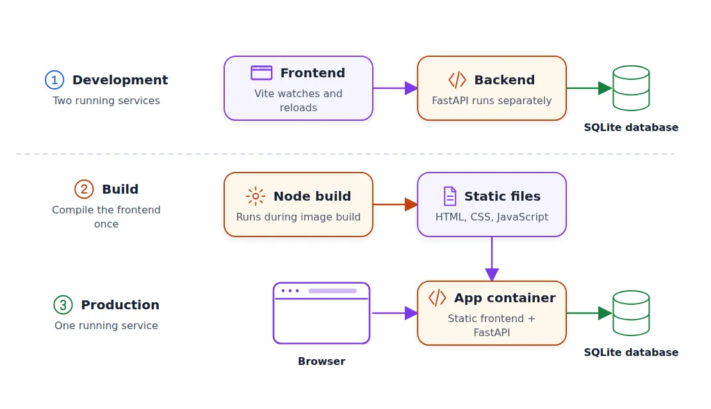

# Deploy a Full-Stack App with AI Coding Assistants

## Containerization

When we run the application locally, we need to execute two commands: one for the frontend and one for the backend.

Let’s run them in two separate terminals:

```
# first terminal
cd frontend
npm run dev

# second terminal
make run
```

So, we have two services, and we need to deploy them to production. We may think that we need two containers: one for the frontend and one for the backend.

During development, we run the frontend as a separate service because we use Vite. Vite watches the frontend code and refreshes the page when we make changes. It’s very convenient because we can see our changes immediately.

In production, the frontend code doesn’t change while the application is running. We build it once and get a set of static HTML, CSS, and JavaScript files.

This means we don’t need a separate container for the frontend: the backend can serve these files. So, we need only one container.

<p align="center">
  
  <p align="center">In development (1), the frontend and backend run separately. In production (2, 3), FastAPI serves the built frontend from one container</p>
</p>

Ask the coding assistant to create it:

```
Create a Dockerfile that builds the frontend with Node, then builds a Python image with the backend and the frontend static files.

Backend should serve the frontend.
```

We get a two-stage Docker build:

- First, we use a Node.js image to compile the frontend

- Then we build the backend and copy only the frontend files without the Node.js dependencies

Build and run the image from the repository root:

```
docker build -t sdip:latest .

docker run --rm -p 8091:8091 \
  -v sdip-data:/data \
  -e SDIP_DATABASE_URL=sqlite:////data/sdip.db \
  --name sdip sdip:latest
```

Here we specify a named Docker volume sdip-data that will keep the SQLite database between container runs.

Open the application at localhost:8000 and test it:

- Create an interview session

- Open the join link in a different browser window

- Move an element in the candidate window

- Check that the interviewer sees the change

We’ll repeat this test again. I’ll refer to it as the two-session test.

## Switch from SQLite to Postgres

SQLite is very convenient for local development. It keeps the data in a single file and doesn’t need a separate database server.

But for production, we typically use Postgres or a similar database.

When we set up the foundation in the previous article, we asked the coding agent to use SQLAlchemy.

I did this on purpose because I knew that later I’d switch to Postgres.

Start Postgres locally:

```
docker run -d \
  --name interview-canvas-db \
  -e POSTGRES_USER=sdip \
  -e POSTGRES_PASSWORD=sdip \
  -e POSTGRES_DB=sdip \
  -p 5432:5432 \
  -v interview-canvas-pgdata:/var/lib/postgresql/data \
  postgres:16-alpine
```

Now we can ask the assistant to use it:

```
Add Postgres support to the backend.
```

When it’s done, repeat the two-session test.
